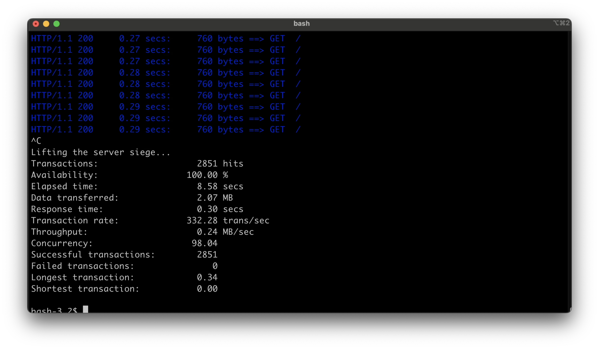

# webserv

## Description

webserv is a HTTP/1.1 (RFC 2616) server written in C++98.
Implements features of CGI (RFC 3875).

### Additional features

- Supports PHP and Python CGI
- Supports cookies
- Implements *BSD kqueue for I/O Multiplexing

## Usage

```shell
# Compile the sources
make
```
```shell
# Run the server
./webserv [config_file]
```

Sample config files provided with the server.  

# Stats

Availability stats with siege of 100 concurrent users:  

